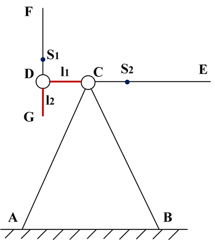
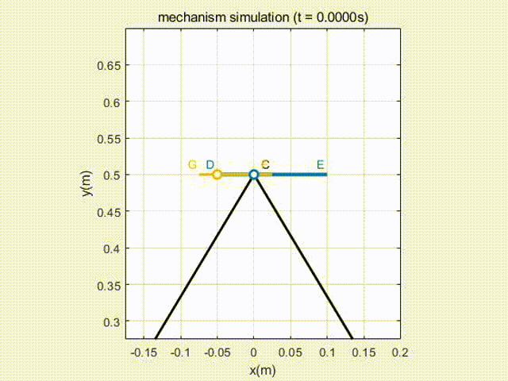
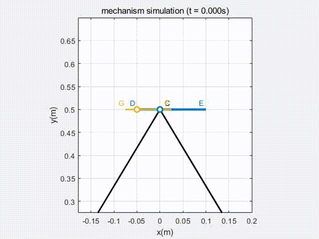
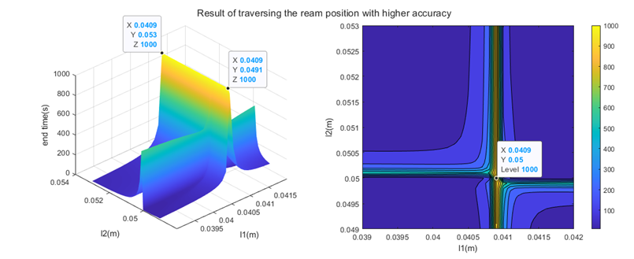
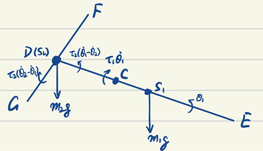

# double-pendulum
A Homework of Advanced mechanical dynamics

​       Double pendulum is defined as follows. s1 and s2 denote the mass point of the bend DE and FG, respectively. At the beginning of swinging, each bend is parallel to the AB, with a speed of zero. 

## Simulation results

$\tau_1=\tau_2=0.05N\cdot m/(rad/s)$

$\tau_1=\tau_2=0.005N\cdot m/(rad/s)$

## Optimization of the rod length

To get the rod length l1 and l2 so that the pendulum can swing as long as it can, I traverse all the possible value. 

The first round of traverse calculates the optimum results which remains $l_1=0.0405m,l_2=0.05m$

More precise traverse ends the optimization process with the result of  $l_1=0.0409m,l_2=0.05m$

## Several other simulation results

/l1=0.041 l2=0.05 t1=0 t2=0.gif)

/l1=0.041 l2=0.05 t1=0.1 t2=0.05.gif)

/l1=0.041 l2=0.05 t1=0.005 t2=0.05.gif)

/l1=0.041 l2=0.05 t1=0.1 t2=0.gif)

## Code Usage

1. run the `pro1.m` to simulate the pendulum with the parameters of $l_1=0.05m,l_2=0.025m,\tau_1=\tau_2=0.05N\cdot m/(rad/s)$, and plot the position, velocity and acceleration of the points E, F.
2. run the `por2_ream_traverse.m` to traverse the rod length, i.e., the value of $l_1$ and $l_2$
3. run the `pro2_ream_genetic.m` to use the MATLAB genetic algorithm function `ga()` to optimize the rod length.
4. run the `pro2_torque.m` to traverse the damping coefficient.

All the functions used in the above programs are in the folder `funcs`, and the previous results are stored in the folder `results`.

